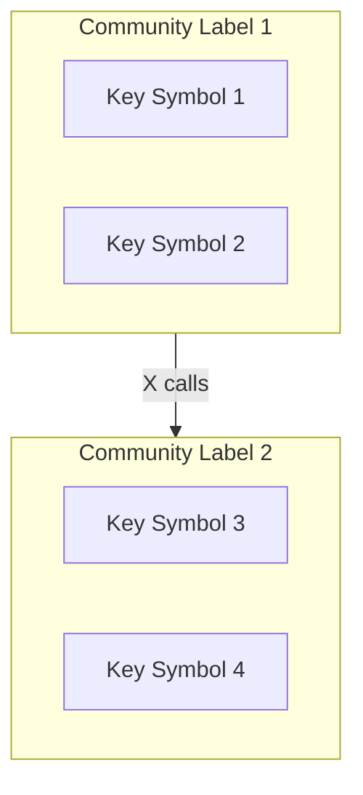

# Generate Architecture Map

Create a comprehensive architecture map of this codebase and save it to `ARCHITECTURE.md` with a mermaid diagram.

## Step 1: Read the Map Resource

Read the map resource to get the high-level overview:

```
noodlbox://$ARGUMENTS
```

This provides:
- Repository stats (communities, symbols, processes)
- Top communities with key symbols and entry points
- Cross-community flows (how modules connect)

## Step 2: Explore Key Communities

For each major community from Step 1, read its details:

```
noodlbox://$ARGUMENTS/community/{community_id}
```

This provides:
- All symbols in the community with centrality scores
- Entry points (symbols called from outside)
- Processes (execution flows)
- Connections to other communities

## Step 3: Trace Key Symbols

For high-centrality symbols identified in Steps 1-2, trace their execution flows to understand how they connect the architecture.

### 3.1: Understand Architectural Context

```cypher
MATCH (cs:CODE_SYMBOL {name: '<symbol_name>'})
MATCH (cs)-[:PROCESS_STEP]->(p:PROCESS)
MATCH (p)-[:BELONGS_TO_COMMUNITY]->(c:COMMUNITY)
RETURN p.name as process, p.centrality as process_importance,
       c.name as community, c.size as community_size, c.cohesion
```

### 3.2: Find Callers (Upstream)

```cypher
MATCH (caller:CODE_SYMBOL)-[:CALLS]->(cs:CODE_SYMBOL {name: '<symbol_name>'})
RETURN caller.name, caller.kind, caller.file_path, caller.centrality
ORDER BY caller.centrality DESC
LIMIT 20
```

### 3.3: Find Dependencies (Downstream)

```cypher
MATCH (cs:CODE_SYMBOL {name: '<symbol_name>'})-[:CALLS]->(called:CODE_SYMBOL)
RETURN called.name, called.kind, called.file_path, called.centrality
ORDER BY called.centrality DESC
LIMIT 20
```

### 3.4: Cross-Community Dependencies

```cypher
MATCH (caller:CODE_SYMBOL)-[:CALLS]->(cs:CODE_SYMBOL {name: '<symbol_name>'})
MATCH (caller)-[:PROCESS_STEP]->()-[:BELONGS_TO_COMMUNITY]->(c1:COMMUNITY)
MATCH (cs)-[:PROCESS_STEP]->()-[:BELONGS_TO_COMMUNITY]->(c2:COMMUNITY)
WHERE c1 <> c2
RETURN c1.name as calling_from, c2.name as called_in, count(*) as calls
```

### 3.5: Multi-Hop Trace (2-3 levels)

```cypher
MATCH path = (cs:CODE_SYMBOL {name: '<symbol_name>'})-[:CALLS*1..3]->(dep:CODE_SYMBOL)
WHERE dep.centrality > 0.5
RETURN dep.name, dep.file_path, length(path) as depth, dep.centrality
ORDER BY dep.centrality DESC
LIMIT 20
```

Repeat for each key symbol to build a complete picture of the architecture.

## Step 4: Write Architecture Document

Create `ARCHITECTURE.md` in the repository root with this structure:

```markdown
# Architecture Overview

## Summary
[Brief description of what this codebase does based on community names and key symbols]

## Stats
- Communities: X
- Symbols: X
- Processes: X

## Modules

### [Community Label]
- **Purpose**: [Inferred from key symbols and processes]
- **Key Symbols**: [Top symbols by centrality]
- **Entry Points**: [How other modules interact with this]
- **Cohesion**: X.XX

[Repeat for each major community]

## Key Execution Flows

### [Symbol Name]
- **Location**: `file_path:line`
- **Centrality**: X.XX
- **Callers**: [List of upstream callers]
- **Dependencies**: [List of downstream calls]
- **Cross-Community Impact**: [Which modules this connects]

[Repeat for key symbols traced in Step 3]

## Data Flows

### [Flow Name]
**From**: [Source Community] → **To**: [Target Community]
**Call Count**: X
[Description of what this flow does based on the symbols involved]

[Repeat for significant cross-community flows]

## Architecture Diagram


```

## Step 5: Generate Mermaid Diagram

Based on the cross-flows data, create a mermaid diagram showing:
- Each community as a subgraph with a sanitized ID and label
- Key symbols as nodes within subgraphs
- Cross-community calls as edges with call counts

**Mermaid Tips:**
- Sanitize IDs: Replace spaces/special chars with underscores
- Use short labels for readability
- Use `graph TB` for top-to-bottom or `graph LR` for left-to-right
- Add call counts on edges: `-->|47 calls|`
- Escape quotes in labels with `#quot;`

## Output

Save the complete architecture document to `ARCHITECTURE.md` in the repository root.
